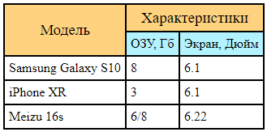
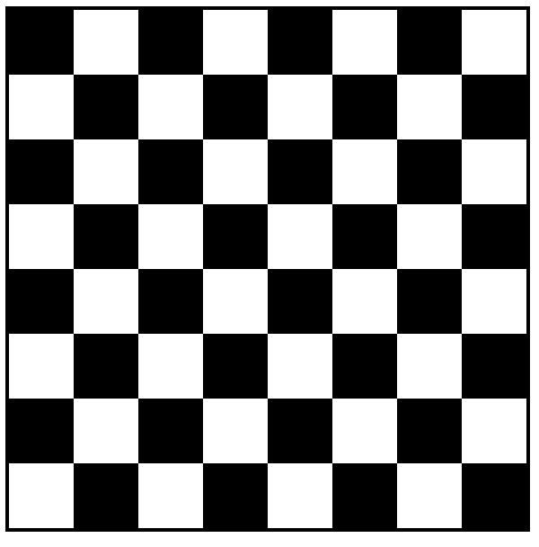

## Таблицы

> **⚡️ Домашнее задание #1**

- Сверстать данную таблицу.

> **⚡️ Домашнее задание #2**

- Создать с помощью таблицы шахматную доску (8*8)
    - Раскрасить ячейки необходимо только по тегам, используя nth-child (классы и id нельзя использовать)

#### Пример

