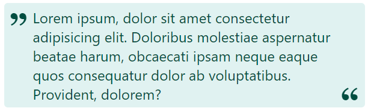

## Псевдоэлементы before и after

> **⚡️ Домашнее задание #1**

- Сверстать кавычки для текста, используя всевдоэлементы `before` и `after`



> **⚡️ Домашнее задание #2**

- Сверстать логотип "Яндекс Go" ("Яндекс.Такси")
- Особенность в том, что нельзя изменять базовый HTML. Можно менять только CSS
- Нужно использовать псевдоэлементы before и after


- Базовый HTML (менять нельзя). Стили нужно прописывать в файле index.css

```html
<!DOCTYPE html>
<html>
<head>
	<!-- Стилизовать можно в файле index.css -->
	<link rel="stylesheet" type="text/css" href="index.css">
</head>
<body>
	<!-- Здесь ничего дописывать нельзя -->
</body>
</html>
```
