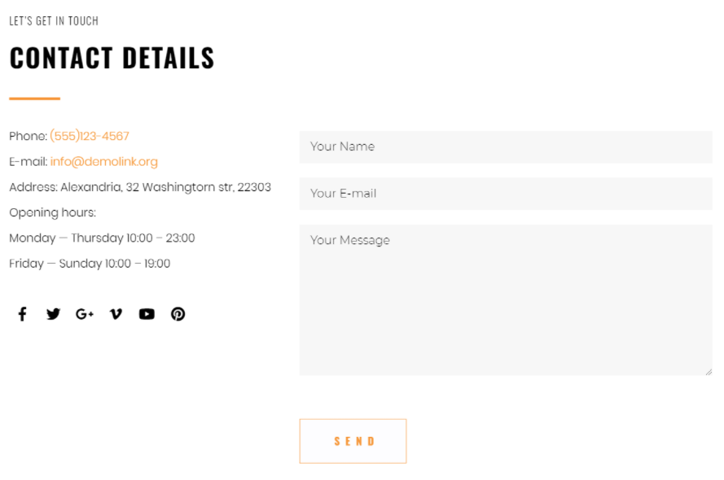
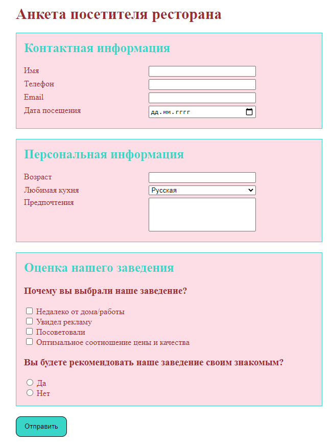

## Формы

> **⚡️ Домашнее задание #1**

- Сверстать форму со страницы. [Ссылка](https://www.templatemonster.com/demo/76333.html)

> **⚡️ Домашнее задание #2**

- Создать страницу с анкетой
- Для этого внимательно просмотрите код страницы с примером, чтобы верно выбрать тип input в каждом случае
- Текст рядом с чекбоксами и радиокнопками привязать к соответствующим элементам.
- Ссылка на страницу с примером. [Ссылка](https://it-school58.github.io/webcourses-homework/1-module-html/form/demo/Form.html)

#### Пример

