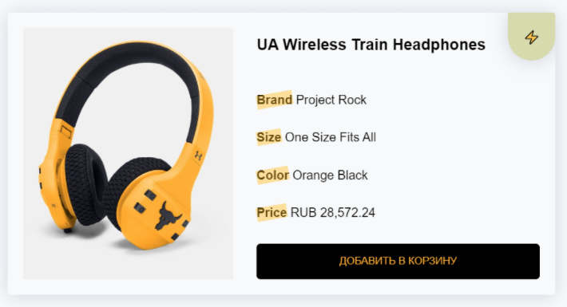
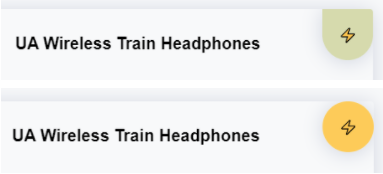

##  Адаптивность и CSS Grid

> **⚡️ Домашнее задание #1**

- Пройти игру CssGridGarden. [Ссылка](https://cssgridgarden.com/#ru)

> **⚡️ Домашнее задание #2**

- Сделать адаптивную карточку товара

---

- Изначальная ширина карточки 750px (рисунок 1)
- При ширине экрана 800px и меньше, применяется медиа-выражение для карточки товара (рисунок 2)
- При ширине экрана 600px и меньше, применяется медиа-выражение для карточки товара (рисунок 3)

#### Рисунок 1. Ширина экрана максимальная

#### Рисунок 2. Ширина экрана от 800px до 600px

#### Рисунок 3. Ширина экрана 600px и меньше

#### Анимация декоративного элемента

