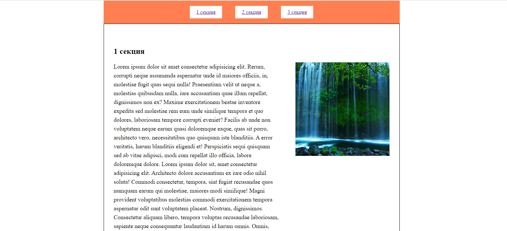
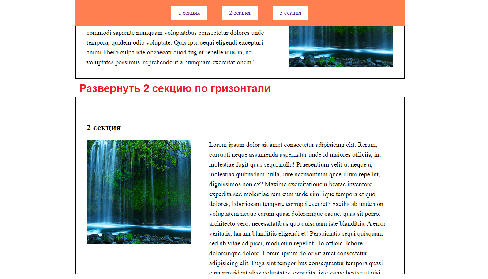

## Position

> **⚡️ Домашнее задание**

- Сверстать страницу по примеру.
- Текст любой, Картинка любая

---

- На странице должно быть:
	- Фиксированное меню (При прокрутке не пропадает). Ссылки в меню должны быть привязаны к соответствующим секциям.
	- Три секции. В каждую секцию добавить заголовок и два блока, расположенных в ряд. В первый блок добавить много текста. Во второй блок добавить небольшую картинку. При прокрутке картинка должна прилипать и двигаться до конца блока.
	- Вторую секцию развернуть по горизонтали.

