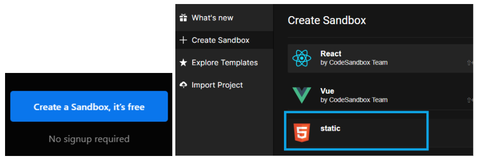
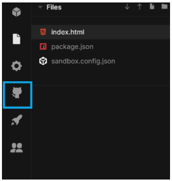
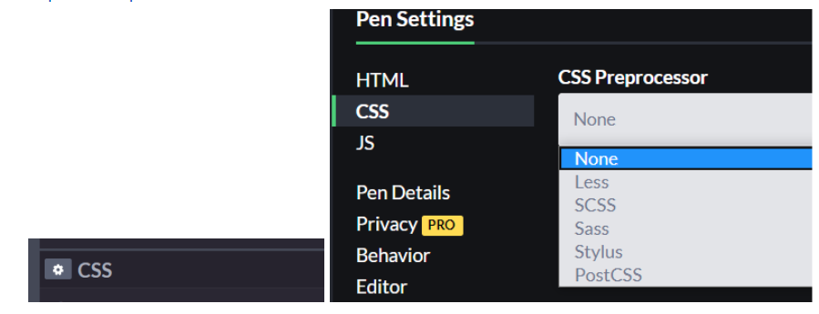

## Препроцессоры и онлайн-редакторы

> **⚡️ Домашнее задание #1**

- Работа с онлайн-редактором кода codesandbox.io
1. Зарегистрироваться в Codesandbox. [Ссылка](https://codesandbox.io)
2. Создать проект

3. Сделать интеграцию с GitHub

> **⚡️ Домашнее задание #2**

- Работа с препроцессорами
1. Изучить документацию к Sass. [Ссылка](https://sass-scss.ru/documentation/)
2. Использовать Sass (или любой другой препроцессор) на произвольном мини-проекте. [Ссылка](https://codepen.io/)

