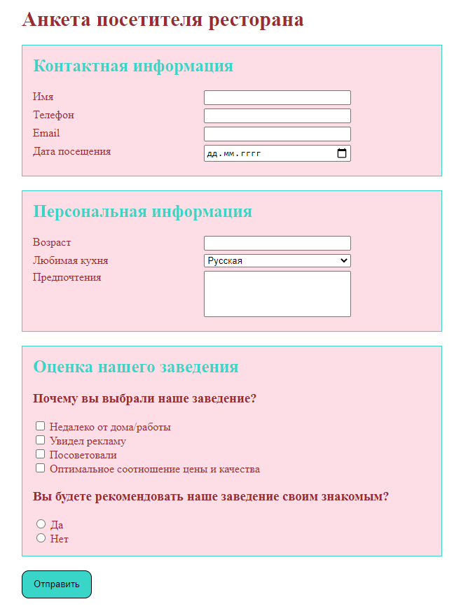

## Формы, css - селекторы

> **Домашнее задание #1**
- Создать страницу с анкетой
- Для этого внимательно просмотрите код страницы с примером, чтобы верно выбрать тип input в каждом случае
- Текст рядом с чекбоксами и радиокнопками привязать к соответствующим элементам.
- Ссылка на страницу с примером: https://danilevs.github.io/HomeWork/8/Form.html

#### Пример

---

> **Домашнее задание #2**
- Сверстать страницу по шаблону (не полностью)
- Картинки желательно вытянуть с шаблона, но можно и любые другие
- Ссылка на шаблон: http://87780.lp.tobiz.net/?v=117862
- Ссылка на итоговую вёрстку: https://danilevs.github.io/HomeWork/8/image.html

---
**Блоки, которые нужно добавить на свою страницу**:
- Первый блок с шапкой и рекламой
- О компании
- Наши преимущества
- Наша команда (первые 4)
- Последний блок с контактами
