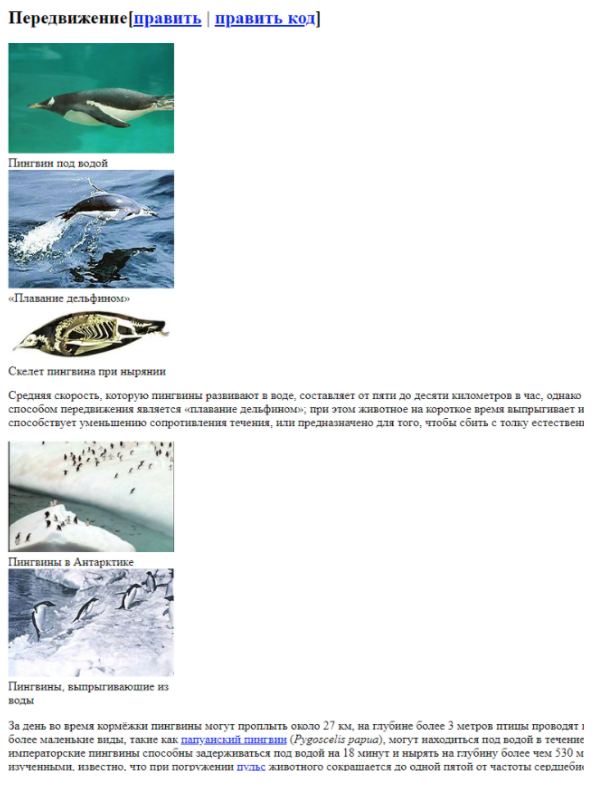
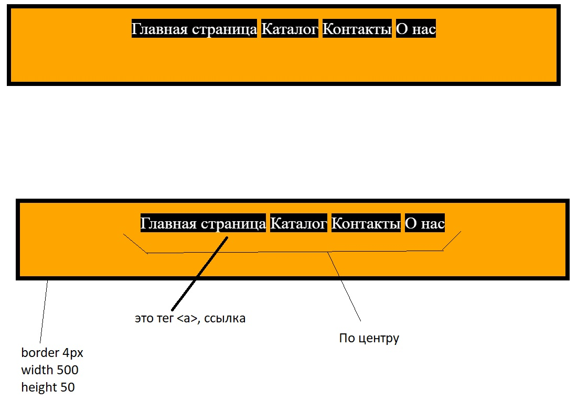

## Текст и изображения

> **⚡️ Домашнее задание #1**

- Создать точно такую же страничку, как на картинке: заголовки, приблизительный размер, цвета, подчеркивания, курсив.
- Постарайтесь всё это сделать своими силами
- Текст есть в документе
- Картинки можете любые свои

---

#### Пример

---

### Текст

Пингвин под водой

«Плавание дельфином»

Скелет пингвина при нырянии

Средняя скорость, которую пингвины развивают в воде, составляет от пяти до десяти километров в час, однако на коротких дистанциях возможны и более высокие показатели. Самым быстрым способом передвижения является «плавание дельфином»; при этом животное на короткое время выпрыгивает из воды, подобно дельфину. Причины такого поведения неясны: вероятно, это способствует уменьшению сопротивления течения, или предназначено для того, чтобы сбить с толку естественных врагов.

Пингвины в Антарктике

Пингвины, выпрыгивающие из воды

За день во время кормёжки пингвины могут проплыть около 27 км, на глубине более 3 метров птицы проводят в среднем около 80 минут в сутки. В нырянии некоторые пингвины бьют рекорды: более маленькие виды, такие как папуанский пингвин (Pygoscelis papua), могут находиться под водой в течение одной или (реже) более двух минут и нырять на глубину до 20 метров, но императорские пингвины способны задерживаться под водой на 18 минут и нырять на глубину более чем 530 метров. Хотя именно сверхспособности императорских пингвинов остаются мало изученными, известно, что при погружении пульс животного сокращается до одной пятой от частоты сердцебиения в состоянии покоя; таким образом потребление кислорода уменьшается, что позволяет увеличить продолжительность нахождения под водой при том же объёме воздуха в лёгких. Остаётся неизвестным механизм регулирования давления и температуры тела при погружении на большую глубину.

При выходе из воды пингвины могут в прыжке преодолеть высоту береговой линии до 1,8 м. Из-за их относительно коротких ног на суше пингвины передвигаются, переваливаясь с боку на бок — такой способ передвижения, как доказали исследования биомехаников, экономит много энергии. На суше пингвины развивают скорость 3—6 км/ч. На льду пингвины также могут быстро передвигаться — съезжают с гор, лёжа на животе. Некоторые виды преодолевают так многие километры между морем и местом, где обосновалась их колония.

> **⚡️ Домашнее задание #2**

- Сверстать похожую структуру

> **⚡️ Домашнее задание #3**

- Сверстать похожую структуру

