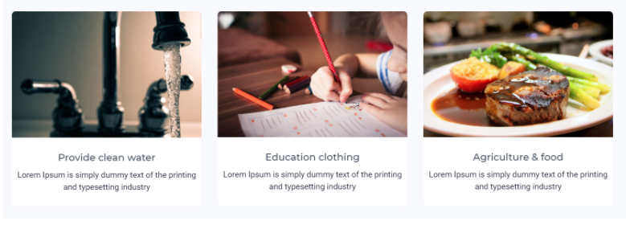
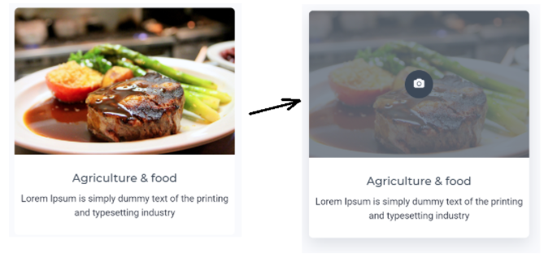

## Трансформация и фильтры

> **⚡️ Домашнее задание #1**

- Сделать подобную трансформацию (по наведению три линии превращаются в крестик)
- [Ссылка](https://codepen.io/Sergeenkov/pen/JZpEBL)

> **⚡️ Домашнее задание #2**

- Верстка секции. [Ссылка](http://www.templatemonsterpreview.com/ru/demo/101096.html)

- Основное внимание нужно уделить изменению внешнего вида элементов по наведению. Необходимо использовать свойство `transform`

