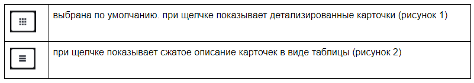
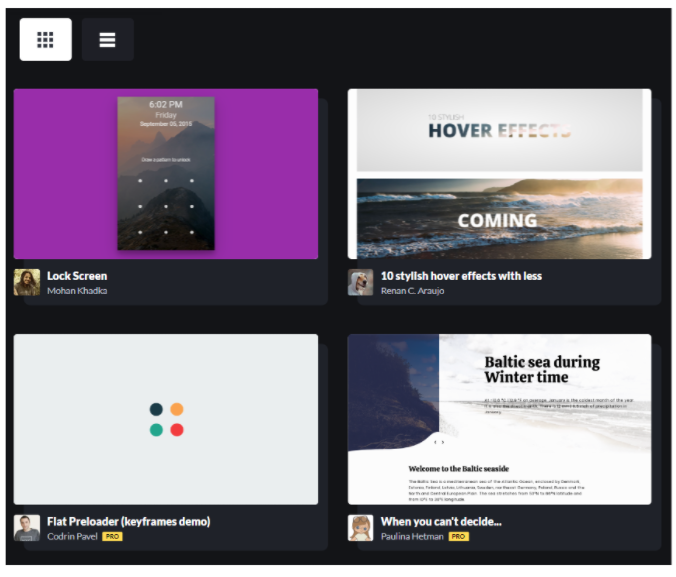
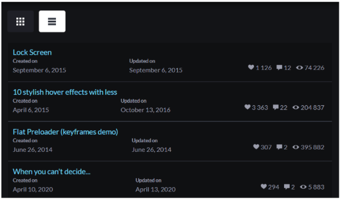

## Атрибуты, работа с CSS

> **⚡️ Домашнее задание**

- Реализовать заданный функционал
- Вёрстка карточек в итоге может отличаться
- Функционал можно посмотреть в здесь. [Ссылка](https://codepen.io/dashboard/)

---

- Есть 2 кнопки

#### Рисунок 1

#### Рисунок 2

