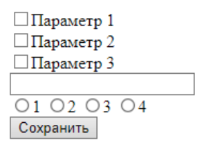

## Local Storage

> **⚡️ Домашнее задание**

1. Создать форму
2. При нажатии на кнопку "Сохранить", читаются все данные из input, radio, checkbox и т.д. и записываюься в объект. Ключ объекта - название поля, значение - value поля.
3. Сохранить полученнный объект в LocalStorage
4. Перезагрузить страницу. После перезагрузки необхожимо прочитать данные из LocalStorage и добавить value в соответсвтующие поля ввода (если был нажат 1й checkbox, он должен быть нажат и после перезагрузки и т.д.)

