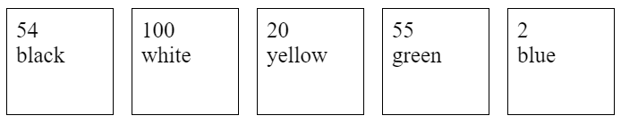

## Объекты и вывод данных на экран

> **⚡️ Домашнее задание #1**

- Дан массив из 5 объектов с ключами `price` и `color`, содержащих разные значения.
- Используя массив сформировать HTML и вывести на страницу (как показано на скрине)

```js
// Код JavaScript
const arr = [
    {
        price: 54,
        color: "black",
    },
    {
        price: 100,
        color: "white",
    },
    {
        price: 20,
        color: "yellow",
    },
    {
        price: 55,
        color: "green",
    },
    {
        price: 2,
        color: "blue",
    },
];
```

```html
<!-- Код HTML -->
<div id="container"></div>
```

#### Результат


> **⚡️ Домашнее задание #2**

- Создать объект с 4 свойствами. Каждое свойство это товар-цена как ключ-значение.
- Создать метод, который складывает эти 4 свойства и выводит в консоль сумму
