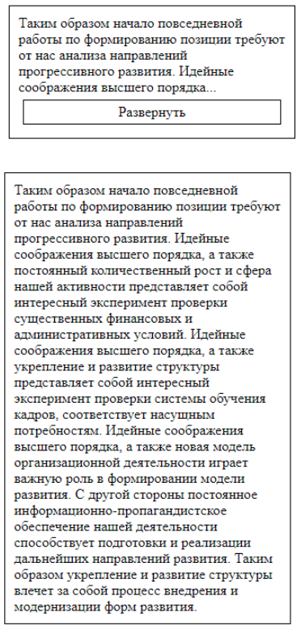

## Методы innerText и innerHTML, Функции, События

> **⚡️ Домашнее задание**

1. Создать функцию `multiplication(a, b)`, которая выводит в консоль произведение `a` и `b`
2. Создать функцию `square(a)`, которая вычисляет и выводит в консоль `a` в степени 2
3. Создать на странице блок с текстом и кнопкой. при нажатии на кнопку текст раскрывается полностью, а кнопка пропадает

