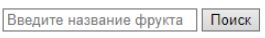

## Методы работы с массивами

> **Домашнее задание**

- Есть массив со строками `["Арбуз", "Апельсин", "Виноград", "Хурма", "Ежевика"]`. На странице есть два элемента

- Необходимо:
1. Вывести изначальный массив в консоль.
2. В поле вводится строка и после нажатия кнопки, с помощью indexOf() определить наличие искомой строки в массиве. Результат поиска вывести в диалоговое окно функцией alert() (Найдена/Не найдена).
3. Если строка найдена, то удалить её из массива методом splice(). Затем вывести массив в консоль.
