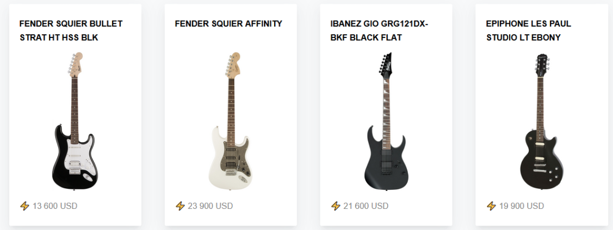

## Сборщики и ES-6 модули

> **⚡️ Домашнее задание #1**

Разработка проекта

- Используя ES-6 модули, сборщик Parcel или Webpack (на выбор) и библиотеку Axios написать приложение, которое запрашивает данные в виде JSON с сервера и визуально отображает на странице
- Запрос можно отправлять на этот адрес (или на свой JSON-сервер). [Ссылка](https://gist.githubusercontent.com/dev-pandaren/a3ad2d177d18402e609ec743676af80a/raw/3889c469f25c71ec11e628acdd12438742506504/guitar-catalog.json)
- Если используете указанный URL для запроса, в ответе должны получить JSON-файл списком товаров у каждого из которых есть `id`, `name`, `img`, `price`. Необходимо отобразить данные на странице в похожем формате (дизайн может отличаться, как и наполнение JSON-файла)

- Для примера приложения (установка Node.js, настройки NPM, Parcel и использования модулей) можно разобрать плейлист. [Ссылка](https://www.youtube.com/playlist?list=PL7cTIfGFrdKmKK4xAJsE31n3SACY0bi9t)

> **⚡️ Домашнее задание #2**

Дополнительный разбор тем (просмотр видео, чтение статей)

- Принцип работы сборщиков проектов: Webpack, Parcel и т.д.
- Чем Webpack отличается от Gulp. В каких случаях лучше использовать Webpack, а в каких Gulp?
- ES-6 модули в JavaScript
- Библиотека Axios. Чем лучше нативного Fetch?
- Использование Github Gist в качестве JSON-сервера
