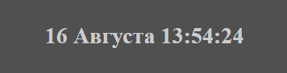

## Дата и время

> **⚡️ Домашнее задание**

- Создать на странице блок с Датой и временем (День/Месяц/Час/Минуты/Секунды). Блок должен быть динамичным, время должно отображаться верным без обновления страницы

- Создать на странице форму для ввода даты рождения. После ввода даты рождения, вычислить и вывести возраст
